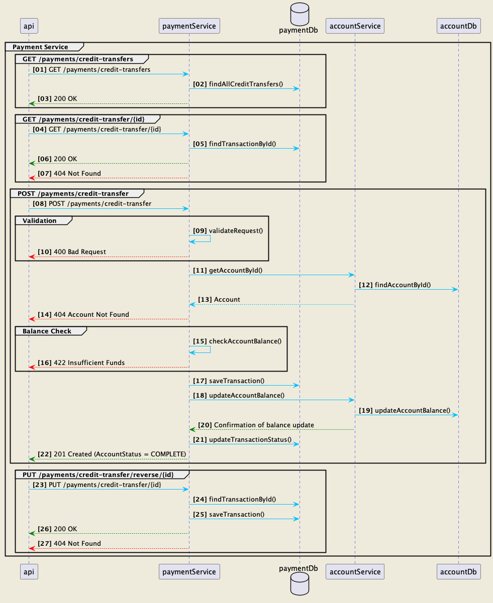

# payment-service

## Description
The payment service is a Spring Boot application that exposes a REST API to manage payments.

## Features
The payment service exposes the following endpoints :
1. GET /payments/credit-transfers : returns the list of all payments
2. GET /payments/credit-transfer/{id} : returns the payment with the given id
3. POST /payments/credit-transfer : creates a new payment

## Build
To build the payment service, run the following command :
```
mvn clean install
```

## Dependencies
The payment service depends on the following projects :
1. [account-service] - to retrieve the account information

## Sequence diagram

